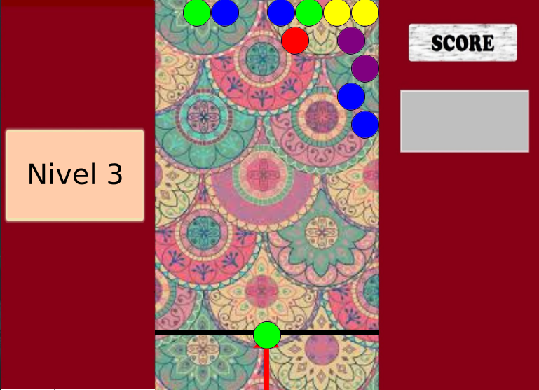

# Bubble Shoot
A simple C++ Bubble Shoot game using allegro5 library

## Dependencies
* Allegro5

## Run
```
git clone git@github.com:omarsalazars/Bubble-Shoot.git
cd Bubble-Shoot
make
./a.out
```

## Images

